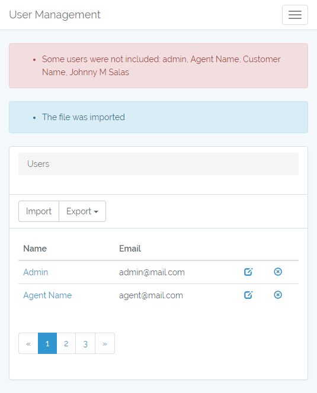

# Laravel 5 Starter Kit

Author: Johnny M. Salas (johmsalas@gmail.com)

This project provides a start point for Laravel projects.

## Implemented features:

- [x] Register and Login
- [x] Login using Facebook
- [x] User administration
- [x] Roles and permission (UI not Implemented)
- [x] Import users from xls, xlsx, cvs, tsv
- [x] Export users to xls, xlsx, cvs, tsv

## Seeds and default database

Included seeds create the following roles and users

#### Roles:
- Administrator
- Agent
- Customer

#### users
- User: admin@mail.com, pass: admin
- User: agent@mail.com, pass: agent
- User: customer@mail.com, pass: customer

## Instalation

Clone the project and navigate to its root folder

`git clone https://github.com/johmsalas/laraveluser.git my_project`

`cd my_project`

Install the NPM dependencies

`npm install`

`npm run dev`

Install the project dependencies

`composer install`

To quickly run the project, using [Homestead](https://laravel.com/docs/5.4/homestead) is recommended

## External libraries

This project is built on Laravel, using some its libraries for different purposes
- socialite: Provides login integration with social networks

Furthermore, the project relies on the following external libraries
- Maatwebsite/Laravel-Excel: Allows to read and write Excel files

## Planned improvements
- [ ] As a MPV the ImportRepository creates directly the users when importing them. That responsability should be removed
